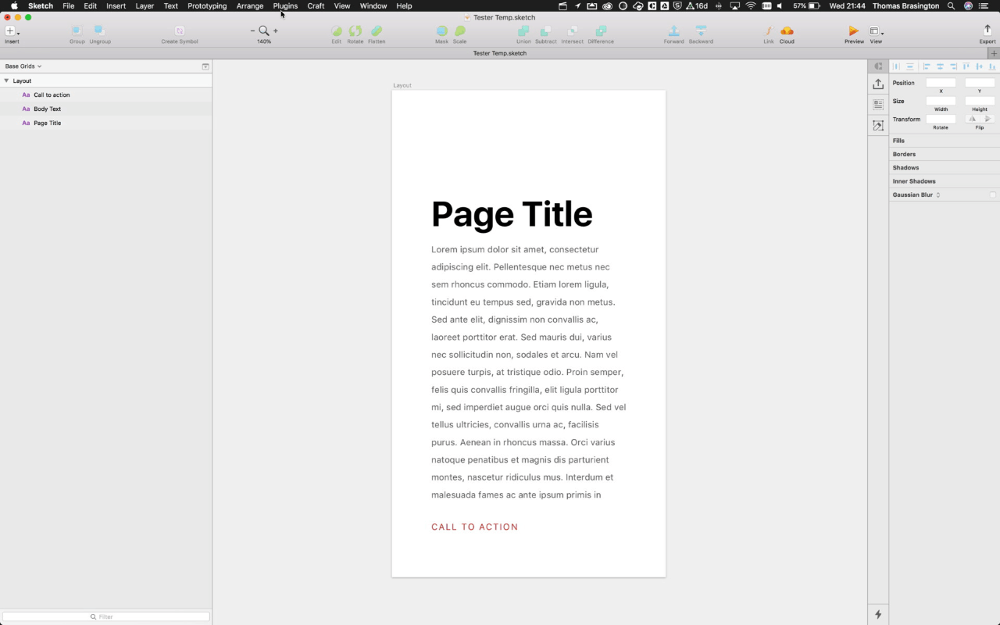

# rename-layers-based-on-textstyle

## What?

This plugin will go through your current pages' text styles and prepend or replace their Text Style name to the layer. 

## Why?

When developers are picking through tools like InVision and Zeplin they can't easily sync up the style reference to your design system. They only get the attributes of the font. This tool means that they can easily see form the generated class names or layer what the style is.

## Installation

1. Download the [rename-layers-based-on-textstyle.zip](https://github.com/tbrasington/rename-layers-based-on-textstyle/raw/master/rename-layers-based-on-textstyle.zip)
2. Unzip
3. Double Click on `rename-layers-based-on-textstyle.sketchplugin` 

## Commands

### Prepend

Takes the Text Syle name and adds it to the front of the the Layer name with a hypen

### Replace

Takes the Text Syle name and replaces the entire layer name with the Text Style

---

@tbrasington | tbrasington.com
